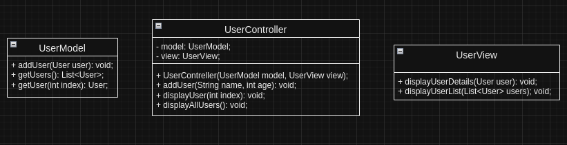

# Pattern MVC de Gerenciamento de Usuários em java

Este projeto é uma implementação básica do padrão **MVC (Model-View-Controller)** em Java, que gerencia uma lista de usuários, permitindo adicionar e visualizar informações de cada usuário. A aplicação consiste em um modelo de dados, uma interface de visualização e um controlador para organizar as operações, separando lógica de negócios, interface do usuário e controle de fluxo.

## Estrutura do Projeto

- **Model**: Gerencia os dados e a lógica de negócios do aplicativo. 
- **User.java**: Classe que define o modelo de dados de um usuário, com atributos como `nome` e `idade`.
- **UserModel.java**: Classe que contém uma lista de usuários e métodos para adicionar e recuperar dados de usuários.

- **View**: Responsável pela exibição das informações ao usuário.
  - **UserView.java**: Classe que exibe os detalhes de um usuário e a lista completa de usuários no console.
  
- **Controller**: Atua como um intermediário, controlando a interação entre a View e o Model.
  - **UserController.java**: Classe que gerencia as operações de adicionar e visualizar usuários, intermediando as ações entre o `UserModel` e o `UserView`.

- **App.java**: Classe principal que inicializa o `Model`, `View` e `Controller`, e executa a aplicação.

## Padrão MVC

O padrão **MVC** (Model-View-Controller) separa a lógica de negócios, a apresentação e o controle da aplicação. A arquitetura permite melhor modularidade e facilita a manutenção e a escalabilidade do código.

- **Model**: Contém os dados e a lógica de negócios (ex.: `User` e `UserModel`).
- **View**: Exibe as informações para o usuário (ex.: `UserView`).
- **Controller**: Atua como um mediador entre `Model` e `View`, processando entradas e comandando as atualizações (ex.: `UserController`).

## Tecnologias Utilizadas

- **Java**: Linguagem de programação para desenvolvimento do sistema.
- **Padrão MVC**: Arquitetura que separa responsabilidades, facilitando a manutenção do código.

## Estrutura de Arquivos

```bash
src/
├── app/
│   └── App.java             # Classe principal da aplicação
├── controller/
│   └── UserController.java  # Controlador que coordena as operações
├── model/
│   ├── User.java            # Classe que define os dados do usuário
│   └── UserModel.java       # Gerencia a lista de usuários
└── view/
    └── UserView.java        # Exibe informações de usuários
```
## Diagrama de Classes (UML)



## Como Executar

**Clone** este repositório.
   ```bash
   git clone https://github.com/seu_usuario/Pattern-mvc-java.git
   cd Pattern-mvc-java
   ```

**Compile** os arquivos Java:
   ```bash
   javac App.java
   ```

**Execute** a aplicação:
   ```bash
   java App.java
   ```


## Exemplo de Saída

```plaintext
User added: Alice
User added: Bob

User List:
- Alice (Age: 28)
- Bob (Age: 34)

User Name: Bob
User Age: 34
```


## Possíveis Melhorias

- Implementar uma interface gráfica.
- Permitir operações de edição e remoção de usuários.
- Adicionar persistência de dados usando banco de dados.
